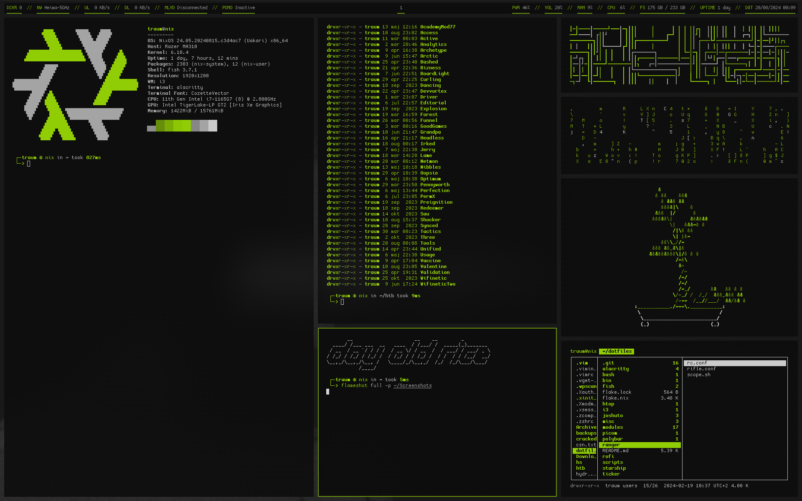

# Traum's NixOS Dotfiles



This repository contains my personal dotfiles for NixOS. It's a comprehensive setup that I use across multiple machines, with a focus on automation, customization, and a streamlined workflow for development and pentesting.

## Key Features

- **Nix Flakes:** The entire configuration is managed using Nix Flakes, ensuring reproducibility and easy management of dependencies.
- **Modular Design:** The configuration is broken down into logical modules, making it easy to understand, customize, and extend.
- **Dynamic Theming:** The color scheme is automatically generated from the current wallpaper using `pywal`, and it's applied to `i3`, `alacritty`, `rofi`, and other tools.
- **Multi-Resolution Support:** The `i3`, `alacritty`, and `rofi` configurations automatically adapt to different screen resolutions.
- **Custom Scripts:** A collection of scripts to automate common tasks, such as setting wallpapers, managing system updates, and more.
- **Pentesting Tools:** A dedicated set of tools and configurations for penetration testing.
- **Development Environments:** Pre-configured development environments for various programming languages and projects.

## Getting Started

### Prerequisites

- A running NixOS installation.
- `git` installed on your system.

### Installation

1.  **Clone the repository:**

    ```bash
    git clone https://github.com/borttappat/dotfiles ~/.dotfiles
    ```

2.  **Run the installation script:**

    ```bash
    cd ~/.dotfiles
    ./scripts/bash/nixsetup.sh
    ```

    This script will back up your existing NixOS configuration and then build and activate the new configuration from this repository.

## Directory Structure

```
.
├── flake.nix
├── README.md
├── alacritty
├── bash
├── bin
├── configs
├── fish
├── htop
├── i3
├── joshuto
├── misc
├── modules
├── picom
├── polybar
├── ranger
├── rofi
├── scripts
├── shells
├── starship
├── tools
├── vim
├── wal
├── wallpapers
├── xorg
├── zathura
└── zsh
```

- **`flake.nix`:** The heart of the configuration, defining the system's dependencies and modules.
- **`modules/`:** Contains the modularized NixOS configuration. Each file in this directory corresponds to a specific part of the system (e.g., `users.nix`, `services.nix`, `gaming.nix`).
- **`scripts/`:** A collection of useful scripts for managing the system.
- **`configs/`:** Contains configuration files for various applications that are not managed directly by Nix.
- **`tools/`:** A collection of custom tools and utilities.
- **`wallpapers/`:** A collection of wallpapers that are used to generate the system's color scheme.

## Customization

### Adding a New User

To add a new user, you'll need to edit the `modules/users.nix` file. You can add a new user by following the existing structure.

### Changing the Wallpaper

You can change the wallpaper by running the `randomwalrgb.sh` script. This script will select a random wallpaper from the `wallpapers/` directory, set it as your desktop background, and then regenerate the color scheme for all your applications.

### Adding New Packages

To add new packages to your system, you can add them to the `packages` list in `modules/packages.nix`.

## Troubleshooting

### The screen is blank after logging in

This is expected. The default login is to a TTY. To start the graphical environment, simply type `x` and press Enter.

### The colors are not updating correctly

If the colors are not updating correctly after changing the wallpaper, you can try running the `walrgb.sh` script manually. This script will force a regeneration of the color scheme.

## Contributing

Contributions are welcome! If you have any suggestions or improvements, feel free to open an issue or submit a pull request.

## License

This project is licensed under the MIT License. See the [LICENSE](LICENSE) file for more details.